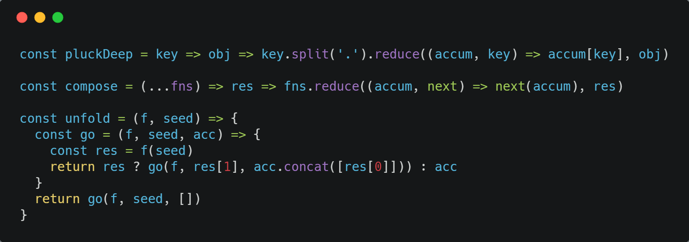

# markdown的使用示例

## Images
```text

```


## internal link
```text
Please see the [anaconda](tools/anaconda.md) for more details.
```
Please see the [anaconda](tools/anaconda.md) for more details.

## tables
```text
First Header | Second Header | Third Header
------------ | ------------- | ------------
Content Cell | Content Cell  | Content Cell
Content Cell | Content Cell  | Content Cell
```
First Header | Second Header | Third Header
------------ | ------------- | ------------
Content Cell | Content Cell  | Content Cell
Content Cell | Content Cell  | Content Cell