# MySQL执行计划解读
## Explain语法
```text
EXPLAIN  SELECT ……
变体：
1. EXPLAIN EXTENDED SELECT ……
将执行计划“反编译”成SELECT语句，运行SHOW WARNINGS 可得到被MySQL优化器优化后的查询语句 
2. EXPLAIN PARTITIONS SELECT ……
用于分区表的EXPLAIN
```
执行计划包含的信息  
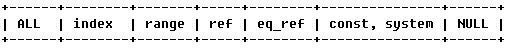

## id
*包含一组数字，表示查询中执行select子句或操作表的顺序*

**id相同，执行顺序由上至下**
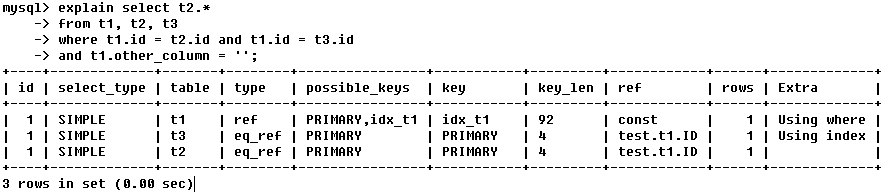
     
**如果是子查询，id的序号会递增，id值越大优先级越高，越先被执行**


**id如果相同，可以认为是一组，从上往下顺序执行；在所有组中，id值越大，优先级越高，越先执行**
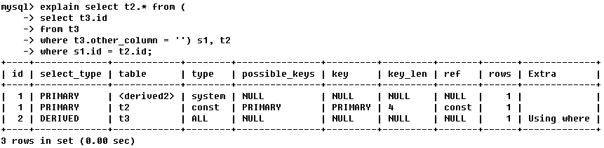

## select_type 
表示查询中每个select子句的类型（简单 OR复杂）
 


1. SIMPLE：查询中不包含子查询或者UNION
2. 查询中若包含任何复杂的子部分，最外层查询则被标记为：PRIMARY
3. 在SELECT或WHERE列表中包含了子查询，该子查询被标记为：SUBQUERY
4. 在FROM列表中包含的子查询被标记为：DERIVED（衍生）
5. 若第二个SELECT出现在UNION之后，则被标记为UNION；若UNION包含在  FROM子句的子查询中，外层SELECT将被标记为：DERIVED
6. 从UNION表获取结果的SELECT被标记为：UNION RESULT
 
## type
 
表示MySQL在表中找到所需行的方式，又称“访问类型”，常见类型如下：

 


由左至右，由最差到最好
 
1. ALL：Full Table Scan， MySQL将遍历全表以找到匹配的行
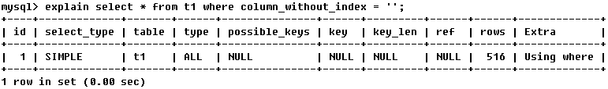

2. index：Full Index Scan，index与ALL区别为index类型只遍历索引树

 
3. range：索引范围扫描，对索引的扫描开始于某一点，返回匹配值域的行，常见于between、<、>等的查询

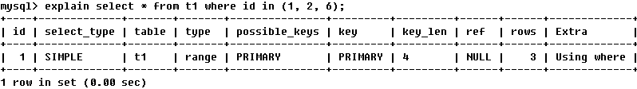
range访问类型的不同形式的索引访问性能差异
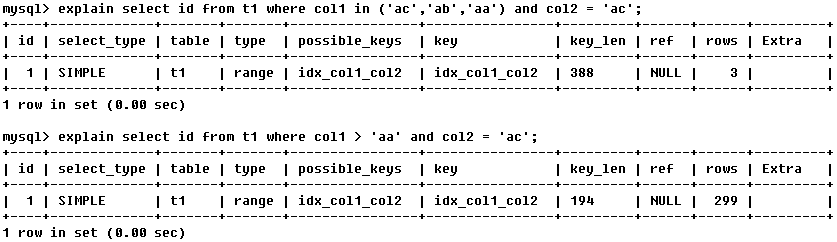

4. ref：非唯一性索引扫描，返回匹配某个单独值的所有行。常见于使用非唯一索引即唯一索引的非唯一前缀进行的查找

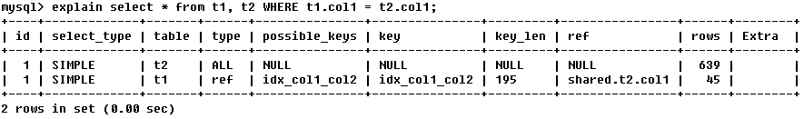
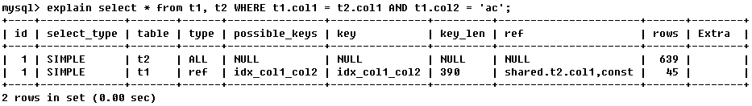
 
5. eq_ref：唯一性索引扫描，对于每个索引键，表中只有一条记录与之匹配。常见于主键或唯一索引扫描
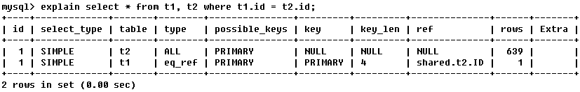
 
6. const、system：当MySQL对查询某部分进行优化，并转换为一个常量时，使用这些类型访问。如将主键置于where列表中，MySQL就能将该查询转换为一个常量
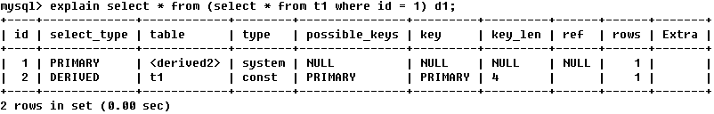
system是const类型的特例，当查询的表只有一行的情况下， 使用system
 
7. NULL：MySQL在优化过程中分解语句，执行时甚至不用访问表或索引
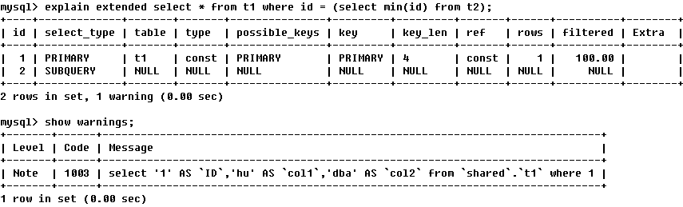
 
## possible_keys
 
指出MySQL能使用哪个索引在表中找到行，查询涉及到的字段上若存在索引，则该索引将被列出，但不一定被查询使用
 
## key
显示MySQL在查询中实际使用的索引，若没有使用索引，显示为NULL
TIPS：查询中若使用了覆盖索引，则该索引仅出现在key列表中
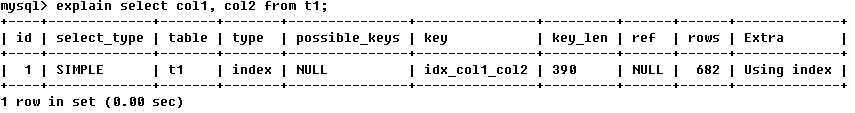


 

## key_len
表示索引中使用的字节数，可通过该列计算查询中使用的索引的长度


 


key_len显示的值为索引字段的最大可能长度，并非实际使用长度，即key_len是根据表定义计算而得，不是通过表内检索出的
 
## ref
表示上述表的连接匹配条件，即哪些列或常量被用于查找索引列上的值

 


本例中，由key_len可知t1表的idx_col1_col2被充分使用，col1匹配t2表的col1，col2匹配了一个常量，即 ’ac’
 
 
## rows
表示MySQL根据表统计信息及索引选用情况，估算的找到所需的记录所需要读取的行数

 


 

## Extra
包含不适合在其他列中显示但十分重要的额外信息
 
1. Using index
该值表示相应的select操作中使用了覆盖索引（Covering Index）

TIPS：覆盖索引（Covering Index）  
MySQL可以利用索引返回select列表中的字段，而不必根据索引再次读取数据文件  
包含所有满足查询需要的数据的索引称为 覆盖索引（Covering Index）  
注意：  
如果要使用覆盖索引，一定要注意select列表中只取出需要的列，不可select *，因为如果将所有字段一起做索引会导致索引文件过大，查询性能下降
 
2. Using where
表示MySQL服务器在存储引擎受到记录后进行“后过滤”（Post-filter）,
如果查询未能使用索引，Using where的作用只是提醒我们MySQL将用where子句来过滤结果集
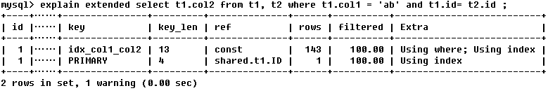
 
3. Using temporary
表示MySQL需要使用临时表来存储结果集，常见于排序和分组查询
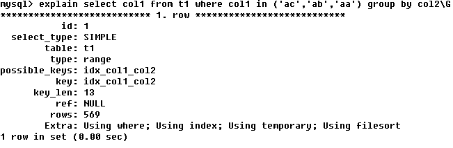

 
4. Using filesort
MySQL中无法利用索引完成的排序操作称为“文件排序”
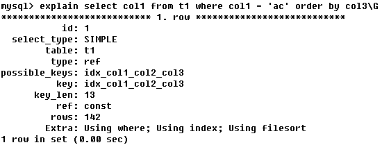

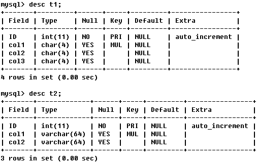
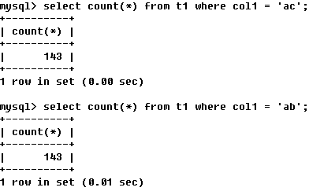
 


 


 


 


 

## MySQL执行计划的局限
 
- EXPLAIN不会告诉你关于触发器、存储过程的信息或用户自定义函数对查询的影响情况
- EXPLAIN不考虑各种Cache
- EXPLAIN不能显示MySQL在执行查询时所作的优化工作
- 分统计信息是估算的，并非精确值
- EXPALIN只能解释SELECT操作，其他操作要重写为SELECT后查看执行计划
 