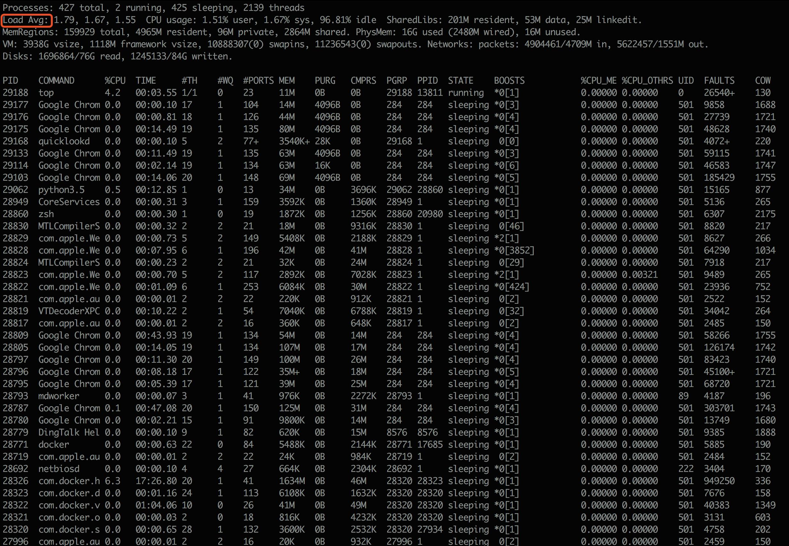

# cpu使用率和负载
当我们使用top命令查看系统的资源使用情况时会看到 load average，如下图所示。它表示系统在1、5、15分钟的平均工作负载。  

**load average**: 系统平均负载是CPU的Load，它所包含的信息不是CPU的使用率状况，而是在一段时间内CPU正在处理以及等待CPU处理的进程数之和的统计信息，也就是CPU使用队列的长度的统计信息。这个数字越小越好。

## CPU负载和CPU利用率的区别
**CPU利用率**：显示的是程序在运行期间实时占用的CPU百分比

**CPU负载**：显示的是一段时间内正在使用和等待使用CPU的平均任务数。CPU利用率高，并不意味着负载就一定大。举例来说：如果我有一个程序它需要一直使用CPU的运算功能，那么此时CPU的使用率可能达到100%，但是CPU的工作负载则是趋近于“1”，因为CPU仅负责一个工作嘛！如果同时执行这样的程序两个呢？CPU的使用率还是100%，但是工作负载则变成2了。所以也就是说，当CPU的工作负载越大，代表CPU必须要在不同的工作之间进行频繁的工作切换。

**举例说明**

网上有篇文章举了一个有趣比喻，拿打电话来说明两者的区别，我按自己的理解阐述一下。

某公用电话亭，有一个人在打电话，四个人在等待，每人限定使用电话一分钟，若有人一分钟之内没有打完电话，只能挂掉电话去排队，等待下一轮。电话在这里就相当于CPU，而正在或等待打电话的人就相当于任务数。

在电话亭使用过程中，肯定会有人打完电话走掉，有人没有打完电话而选择重新排队，更会有新增的人在这儿排队，这个人数的变化就相当于任务数的增减。为了统计平均负载情况，我们5分钟统计一次人数，并在第1、5、15分钟的时候对统计情况取平均值，从而形成第1、5、15分钟的平均负载。

有的人拿起电话就打，一直打完1分钟，而有的人可能前三十秒在找电话号码，或者在犹豫要不要打，后三十秒才真正在打电话。如果把电话看作CPU，人数看作任务，我们就说前一个人（任务）的CPU利用率高，后一个人（任务）的CPU利用率低。

当然， CPU并不会在前三十秒工作，后三十秒歇着，只是说，有的程序涉及到大量的计算，所以CPU利用率就高，而有的程序牵涉到计算的部分很少，CPU利用率自然就低。但无论CPU的利用率是高是低，跟后面有多少任务在排队没有必然关系。

# 负载为多少才算比较理想？
这个有争议，各有各的说法，个人比较赞同CPU负载小于等于0.5算是一种理想状态。

不管某个CPU的性能有多好，1秒钟能处理多少任务，我们可以认为它无关紧要，虽然事实并非如此。在评估CPU负载时，我们只以5分钟为单位为统计任务队列长度。如果每隔5分钟统计的时候，发现任务队列长度都是1，那么CPU负载就为1。假如我们只有一个单核的CPU，负载一直为1，意味着没有任务在排队，还不错。

但是我那台服务器，是双核CPU，等于是有4个内核，每个内核的负载为1的话，总负载为4。这就是说，如果我那台服务器的CPU负载长期保持在4左右，还可以接受。

但是每个内核的负载为1，并不能算是一种理想状态！这意味着我们的CPU一直很忙，不得清闲。一般理想的状态是每个内核的负载为0.7左右，0.7乘以内核数，得出服务器理想的CPU负载，比如我这台4核服务器，负载在3.0以下就可以。

# 如何来降低服务器的CPU负载？
最简单办法的是更换性能更好的服务器，不要想着仅仅提高CPU的性能，那没有用，CPU要发挥出它最好的性能还需要其它软硬件的配合。

在服务器其它方面配置合理的情况下，CPU数量和CPU核心数（即内核数）都会影响到CPU负载，因为任务最终是要分配到CPU核心去处理的。两块CPU要比一块CPU好，双核要比单核好。

因此，我们需要记住，除去CPU性能上的差异，CPU负载是基于内核数来计算的！有一个说法，“有多少内核，即有多少负载”。

# CPU使用率到多少才算比较理想？
CPU利用率在过去常常被我们这些外行认为是判断机器是否已经到了满负荷的一个标准，我看到长时间CPU使用率60-80%就认为机器有瓶颈出现。
